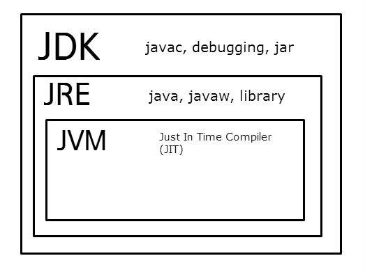

## 목차

- [용어](#용어)
  - [Java SE (Java Platform, Standard Edition)](#Java-SE-(Java-Platform-Standard-Edition))
  - [JDK (Java Development Kit)](#JDK-(Java-Development-Kit))
  - [JRE (Java Runtime Environment)](#JRE-(Java-Runtime-Environment))
  - [JVM (Java Virtual Machine)](#JVM-(Java-Virtual-Machine))
  - [관계도](#관계도)
  - [JDK의 분류](#JDK의-분류)
- [Java 설치와 실행](#Java-설치와-실행)
  - [Java JDK 설치하기](#Java-JDK-설치하기)
  - [Java code 작성 및 실행](#Java-code-작성-및-실행)
- [개발도구와 이클립스](#개발도구와-이클립스)
  - [이클립스(Eclipse)](#이클립스(Eclipse))
  - [이클립스 설치](#이클립스-설치)

- [Java - 이클립스의 기능과 예제의 사용방법](#Java - 이클립스의-기능과-예제의-사용방법)
  - [New Project 생성](#New-Project-생성)
  - [Project 내 New pakage 생성](#Project-내-New-pakage-생성)
  - [Pakage 내 New class 생성](#Pakage-내-New-class-생성)

---


### 용어

---

Java의 다양하고 복잡한 버전들 때문에 용어가 많다. 이를 정리해보자.


- #### Java SE (Java Platform, Standard Edition)

  - 자바의 표준안
  - 자바라는 언어가 어떠한 문법적인 구성을 가졌는지와 같은 것들을 정의하고 있음
  - 소프트웨어의 설계도
  - JCP (Java Community Process, http://jcp.org)라는 조직을 통해서 만들어짐

- #### JDK (Java Development Kit)

  - Java SE의 표준안에 따라서 만들어진 소프트웨어
  - Java 코드를 컴파일하는 컴파일러와 개발에 필요한 각종 두구 그리고 JRE가 포함되어 있음
  - Java 개발자가 다운받아서 사용

- #### JRE (Java Runtime Environment)

  - 자바가 실제로 동작하는 데 필요한 JVM, 라이브러리, 각종 파일들이 포함됨
  - 자바로 만들어진 프로그램을 구동하려고 한다면 이것을 설치해야함
  - 일반인을 위한 Java 프로그램이라 생각

- #### JVM (Java Virtual Machine)

  - 자바가 실제로 구동하는 환경
  - 자바로 만들어진 소프트웨어는 JVM이라는 가상화된 환경에서 구동됨
  - 하드웨어나 운영체제에 따라서 달라질 수 있는 호환성 문제를 해결
  - 즉, 어떤 환경에서도 자바 프로그램을 실행할 수 있게하는 역할

- #### 관계도

  

- #### JDK의 분류

  - **Java SE**
  - Java EE
    - 기업용 시장에서 사용하는 자바 개발환경
  - Java Me
    - 모바일 개발을 위해서 사용하는 자바 버전

---


### Java 설치와 실행

- #### [Java JDK 설치하기](https://www.oracle.com/java/technologies/downloads/)

  - 자신의 운영체제에 맞는 java 다운로드 하기
  - 설치진행
  - java가 설치된 폴더의 bin(나의 경우 `C:\Program Files\Java\jdk-18.0.1.1\bin`)을 시스템 환경변수 Path에 추가하기

- #### Java code 작성 및 실행

  ```java
  class Helloworld {
      public static void main(String[] args) {
          System.out.println("Hello world");
      }
  }
  ```

  - 위 코드를 Helloworld.java 파일로 작성
  - cmd에서 `javac Helloworld.java` 입력
    - `javac` : `.java` (자바 소스코드)를 `.class`로 컴파일  
    - `Helloworld.class`가 컴파일 됨
  - `java Helloworld` 작성
    - `Hello world`가 출력됨
  - 즉 `코드작성 => 컴파일 => 실행` 순서

---

### 개발도구와 이클립스


땅을 팔 때 효율성을 `손 < 삽 < 포크레인` 이다. 이처럼 프로그래밍을 할 때도 도구에 따라 효율성이 차이가 난다. 하지만 개발자 도구에대한 공부가 부족하면 제대로 사용하지 못하므로, 꼭 공부를 하고 진행하도록 하자

- #### 이클립스(Eclipse)

  - 자바의 개발도구
  - IDE (Integrated Development Environment, 통합 개발 환경) 소프트웨어
    - 개발에 필요한 다양한 도구들이 결합되어 있는 소프트웨어
    - 소스 편집기, 컴파일러, 디버거, 유닛테스트 등 여러 도구들이 결합되어 있음
  - 오픈소스, 무료, 다양한 운영체제 지원

- #### [이클립스 설치](https://www.eclipse.org/downloads/)

  - .exe 파일 실행 후 `Eclipse IDE for Enterprise Java and Web Developers ` 다운

---

### Java - 이클립스의 기능과 예제의 사용방법

- #### New Project 생성

  - 설정한 디렉토리 내 `bin`, `src`, `.project` 등이 생성됨

  - ##### src

    - 우리가 작성한 소스코드가 저장됨

  - ##### bin

    - 에플리케이션, 실행파일 등이 저장됨

- #### Project 내 New pakage 생성

- #### Pakage 내 New class 생성

---
