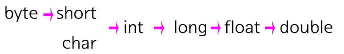

### 숫자와 문자

프로그래밍 입문자에게 가장 익숙한 데이터 타입(data type)은 숫자와 문자일 것이다. 실제로 가장 많이 사용되는 데이터 형인 숫자를 프로그래밍에서는 어떻게 표현하고 연산하는지 알아보자.

**데이터 타입은 자료형 또는 데이터형이라고도 한다.**

- #### 숫자

  - 자바에서는 따옴표가 없는 숫자는 숫자로 인식한다. 

    ```java
    System.out.println(1+2);
    ```

    결과: 3

    ```java
    System.out.println(1.2+1.3);
    ```

    결과: 2.5

  - 곱하기를 할 때는 * 사용

    ```
    System.out.println(2*5);
    ```

  - 나누기를 할 때는 / 사용

    ```
    System.out.println(6/2);
    ```

    결과: 3

- #### 문자와 문자열

  - 자바는 문자(Character)와 문자열(String)을 구분한다. 문자는 한 글자를 의미하고, 문자열은 여러 개의 문자가 결합한 것을 의미한다. 자바에서 문자는 작은따옴표('')로 감싸야 한다.

    ```java
    System.out.println('생');
    ```

    결과: 생

  - 문자열은 큰따옴표("")로 감싸야 한다.

    ```java
    System.out.println("생활코딩");
    ```

    결과: 생활코딩

    **문자열을 작은따옴표로 감싸면 에러가 발생한다!**

  - 하나의 문자를 큰따옴표로 감싼다고 에러가 발생하지는 않는다. 한 글자도 문자열이 될 수 있기 때문이다.

    ```java
    System.out.println("생");
    ```

    결과: 생

  - 문자로 나타낸 숫자를 더하면 결과는?

    ```java
    System.out.println("1"+"1");
    ```

    결과: 11 (문자열)

- #### 이스케이프

  - 만약 문자열 안에 큰따옴표를 넣고 싶다면?

    ```java
    System.out.println("egoing said "Welcome programming world"");
    ```

    표시하고 싶은 값: egoing said "welcome programming world"

    

    결과

    ```
    Exception in thread "main" java.lang.Error: Unresolved compilation problems: 
        Syntax error, insert ")" to complete MethodInvocation
        Syntax error, insert ";" to complete BlockStatements
        Syntax error on token(s), misplaced construct(s)
        The method programming(String) is undefined for the type datatype
        Syntax error on token "world", ( expected
    ```

  - 오류를 해결하기 위해 백슬래쉬(\\) 사용

    ```java
    System.out.println("egoing said \"Welcome programming world\"");
    ```

    결과: egoing said "Welcome programming world"

    - 이러한 기법을 escape(이스케이프)라고 함

    -  큰따옴표가 가진 문법적인 역할에서 도망(escape)쳐서 문자로 인식하도록 한다는 의미

  - 줄바꿈을 입력하고 싶으면 (\\n) 사용

    ```java
    System.out.println("egoing said \n\"Welcome programming world\"");
    ```

    결과:

    ```
    egoing said 
    "Welcome programming world"
    ```

---

### 변수(Variable)

문자나 숫자 같은 데이터를 담는 컨테이너이다. 여기에 담겨진 데이터는 다른 데이터로 바꿀 수 있다. 변수는 마치 자연어에서 대명사와 비슷한 역할을 한다.

- #### 정수 (int)

  ```java
  int a; // int: 데이터 형식-정수, a: 변수의 이름
  a = 1; // 변수 a에 1을 할당 => 실수를 할당하면 Error 발생
  System.out.println(a+1); // 2
  
  a = 2;
  System.out.println(a+1); // 3
  ```

- #### 실수 (double)

  ```java
  double a; // double: 데이터 형식-실수, a: 변수의 이름
  a = 1.1; // 변수 a에 1.1을 할당
  System.out.println(a);
  ```

- #### 문자열 (String)

  ```java
  //String first;
  //first = "coding";
  String first = "coding"; // 위 두 줄을 한 줄로 축약
  String a, b;
  a = "coding";
  b = "everybody";
  System.out.println(a+b);
  ```

  결과: codingeverybody

- #### 변수가 없다면

  - 변수는 코드의 재활용성을 높여줌

  - 예를 들어 100에 10을 더하고, 10을 나눈 후에 다시 10을 빼고 거기에 10을 곱해야 한다고 하면..

    ```java
    System.out.println(100 + 10);
    System.out.println((100 + 10) / 10);
    System.out.println(((100 + 10) / 10) - 10);
    System.out.println((((100 + 10) / 10) - 10) * 10);
    ```

    위 코드에서 100을 1000으로 바꿔야하면 하나하나 바꿔야함

  - 변수를 사용해서 값을 할당하면, 할당된 값만 바꿔주면 됨 => 중복의 제거

    ```java
    int a = 100;
    System.out.println(a + 10);
    System.out.println((a+ 10) / 10);
    System.out.println(((a + 10) / 10) - 10);
    System.out.println((((a + 10) / 10) - 10) * 10);
    ```

    위의 코드에서 첫번째 줄의 100을 다른 숫자로 바꾸면 나머지 로직에 대입되는 변수의 값이 모두 바뀜

  - 재사용성이 높다 = 해야할 일이 줄어든다 => 버그 발생 가능성이 줄어든다
  - 변수를 사용하면 가독성이 높아짐
  - 변수의 효용은 **반복문, 조건문, 함수**와 결합되면 더욱 더 중요해짐

---

### 주석과 세미콜론

- #### 주석

  - 주석(Comment)는 로직에 대한 설명이나 코드를 비활성화 할 때 사용
  - 프로그래밍적으로 해석되지 않음

- #### 한줄 주석

  ```java
  public static void main(String[] args) {
      // 두개의 변수가 같은 데이터 타입 일 때 아래와 같이 코드를 작성한다.
      String a, b;
  }
  ```

- #### 여러줄 주석

  ```java
  public static void main(String[] args) {
      String a, b;
      /*
      a = "coding";
      b = "everybody";
      System.out.println(a+b);
      */
  }
  ```

- #### JavaDoc 주석

  - `/**`로 시작하는 주석은 JavaDoc 주석이라고 해서 자바의 문서를 만들 때 사용한다. 아래 예제는 다음 URL의 문서를 생성한다.

    - http://docs.oracle.com/javase/7/docs/api/java/io/PrintStream.html#println(long)

    ```java
    /**
     * Prints an integer and then terminate the line.  This method behaves as
     * though it invokes <code>{@link #print(int)}</code> and then
     * <code>{@link #println()}</code>.
     *
     * @param x  The <code>int</code> to be printed.
     */
    public void println(int x) {
        synchronized (this) {
            print(x);
            newLine();
        }
    }
    ```

- #### 세미콜론

  - 문장의 끝을 의미

  - 자바에서 문장의 끝에 세미콜론을 사용하지 않으면 컴파일 에러가 발생

    ```java
    // assignment statement
    aValue = 8933.234;
    // increment statement
    aValue++;
    // method invocation statement
    System.out.println("Hello World!");
    // object creation statement
    Bicycle myBike = new Bicycle();
    ```

  - 여러개의 문장을 한줄에 표현 가능

    ```java
    int a = 100; double b = 10.1;
    ```

---

### 데이터 타입

- #### 데이터의 크기

  | 크기                       | 단위        |
  | -------------------------- | ----------- |
  | 8 bit (비트)               | 1 byte      |
  | 1024 byte (바이트)         | 1 kilobyte  |
  | 1024 kilobyte (킬로바이트) | 1 megabyte  |
  | 1024 megabyte (메가바이트) | 1 gigabyte  |
  | 1024 gigabyte (기가바이트) | 1 terabyte  |
  | 1024 terabyte (테라바이트) | 1 petabyte  |
  | 1024 petabyte (페타바이트) | 1 exabyte   |
  | 1024 exabyte (엑사바이트)  | 1 zettabyte |

  - 컴퓨터에 저장되는 정보의 가장 작은 단위는 bit
  - 1 bit는 0이나 1의 값을 가짐
  - **8 bit = 1 byte** 를 기억!

- #### 정수형

  | 데이터 타입 | 메모리의 크기 | 표현 가능 범위                                         |
  | ----------- | ------------- | ------------------------------------------------------ |
  | byte        | 1 byte        | -128 ~ 127                                             |
  | short       | 2 byte        | -32,768 ~ 32,767                                       |
  | int         | 4 byte        | -2,147,483,648~2,147,483,647                           |
  | long        | 8 byte        | -9,223,372,036,854,775,808 ~ 9,223,372,036,854,775,807 |

  - 위 표는 정수에 해당하는 데이터 타입 리스트

  - int가 가장 처리 속도가 빠름

  - 대부분 int를 사용하면 됨

  - `byte a;`를 사용하면 -128 ~ 127까지 할당 가능

    - 표현하는 숫자가 100을 넘지않는 경우 사용하면 됨 => 효율적 처리

    - 예를 들어 행정구역을 숫자로 표시할 때

      | 행정구역 | 할당값 |
      | -------- | ------ |
      | 경기도   | 1      |
      | 전라도   | 2      |
      | 충청도   | 3      |
      | 경상도   | 4      |
      | 제주도   | 5      |
      | 강원도   | 6      |

    - 행정구역의 수가 정해져있음 & 100을 넘을 가능성이 0 => byte로 표현하는 것이 메모리 효율적

    - `long district = 1;`long을 사용하면 8배나 많은 메로리를 사용하게 됨 => 비효율적

  - 어떤 숫자를 저장하느냐에 따라서 사용하는 메모리의 크기가 달라지는 것이 아니고, **어떤 데이터 타입**으로 변수를 선언했느냐에 따라서 **사용하는 메모리의 크기**가 달라지는 것이다!!!

    ```java
    long a = 2147483647;
    long b = 1;
    ```

    위 코드는 똑같이 8 byte의 메모리를 사용

    ```java
    int a = 2147483647;
    long b = 2147483647;
    ```

    위 코드에서 b가 a의 2배의 메모리를 사용

- #### 실수형

  | 데이터 타입 | 메모리의 크기 | 표현 가능 범위                                           |
  | ----------- | ------------- | -------------------------------------------------------- |
  | float       | 4byte         | ±(1.40129846432481707e-45 ~ 3.40282346638528860e+38)     |
  | double      | 8byte         | ±(4.94065645841246544e-324d ~ 1.79769313486231570e+308d) |

  - 실수형은 float과 double이 있음
  - 실수를 사용할 때는 double을 사용!

- #### 문자

  | 데이터 타입 | 메모리의 크기 | 표현 가능 범위     |
  | ----------- | ------------- | ------------------ |
  | char        | 2byte         | 모든 유니코드 문자 |

  - 자바에서 문자와 문자열은 다른 자료형
  - 문자 => 글자 하나, 문자열 => 문자들의 집합
  - String type => 12 byte의 메모리를 사용
    - [String 클래스의 문자열 길이의 한계](https://javacan.tistory.com/entry/46) 참조

---

### 상수의 데이터 타입

- #### 상수(Constant)

  - 변수는 변하는 값을 의미

  - 상수는 변수의 대척점

    ```java
    int a = 1;
    ```

    위 코드에서 a는 변수, 1은 상수

    ```java
    1 = 3;
    ```

    1은 3이 될 수 없기 때문에 컴파일 에러가 발생

  - 고유한 값을 가지고, 그 값을 변경할 수 없는 데이터 타입 = 상수

- #### 실수의 표현

   - 변수를 만들 때 데이터 타입을 지정 => 변수가 메모리를 얼마나 사용할 것인가를 결정

   - 변수에 저장되는 상수도 데이터 타입이 존재!

      ```java
      int a = 2.2;
      ```

      위 코드는 오류를 발생

      ```java
      float a = 2.2;
      ```

      위 코드는 `"Type mismatch: cannot convert from **double** to float"` 에러 발생

      ```java
      double a = 2.2;
      ```

      위 코드는 정상 작동

      

      2.2를 flaot type으로 지정하기 위해서

      ```java
      float a = 2.2F;
      ```

      실수 뒤에 F를 붙임으로써, float 형식을 명확하게 명시해주면 됨

      

- #### 정수의 표현

   - 정수인 상수는 int

      ```java
      int a = 2147483648;
      ```

      위 코드는 오류 발생 => `int는 2147483647`까지 할당 가능

      ```java
      long a = 2147483648;
      ```

      위 코드는 `"The literal 2147483648 of type int is out of range"` 에러 발생

      

      2147483648를 long type으로 지정하기 위해서

      ```java
      long a = 2147483648L;
      ```

      정수 뒤에 L을 붙임으로써, long 형식을 명시

   - byte와  short는 데이터 타입을 명시할 필요가 없음

     ```java
     byte a = 100;
     short b = 200;
     ```

     위 코드는 오류가 발생하지 않음

---

### 형변환(Type Conversion)

형변환은 데이터 타입을 변경하는 것이다. 예를 들어 int형 정수 200의 bit 값은 `00000000 00000000 00000000 11001000`이다. 데이터는 32 bit 즉, 4 byte로 이루어져있다. float형 실수 200.0의 bit 값은 `01000011 01001000 00000000 00000000`이다.

위를 보면 정수 200과 float 200.0의 bit 값이 완전히 다른 것을 알 수 있다. 이렇게 형식이 다른 데이터들을 더하려면 한 쪽의 데이터 타입을 다른 쪽의 데이터 타입으로 전환(Conversion)해야 한다. 이러한 형 변환을 자동으로 처리해주는데, 이러한 전환 작업을 자동(암시적) 형 변환(implicit Conversion)이라고 부른다.

- #### 자동 형 변환

  - 예제를 보자

    ```java
    double a = 3.0F;
    ```

    - 위 코드에서 3.0F는 float형
    - 이 때 3.0F의 값은 자동으로 double 타입으로 형 변환이 일어남
    - double 타입이 float 타입보다 더 많은 수를 표현 할 수 있기 때문에 자동 형 변환이 일어남
    - 타입을 변경해도 **정보의 손실이 일어나지 않는 경우** 자동 형 변환이 발생

  - 반대의 경우 오류가 발생

    ```java
    float a = 3.0;
    ```

    - double 형을 표현 범위가 상대적으로 좁은 float에 넣으려고 하기 때문에 오류 발생
    - 자동 형 변환의 원칙은 **표현범위가 좁은 데이터 타입에서 넓은 데이터 타입으로의 변환**만 허용됨

  - 상수와 상수를 연산한다면?

    ```java
    int a = 3;
    float b = 1.0F;
    double c = a + b;
    ```

    - 두 번의 형 변환이 발생
    - a + b를 위해 변수a가 float형이 됨
    - 변수 c의 타입은 double이기 때문에 float형이 double 형이 됨

- #### 자동 형 변환이 일어나는 규칙(방향성 有)

  - byte 타입은 short가 될 수 있지만 역은 성립하지 않음



- #### 명시적 형 변환

  - 자동 형 변환이 적용되지 않는 경우 수동으로 형 변환을 해야함 => 명시적(Explicit Conversion)이라고 함

    ```java
    float a = (float)100.0;
    int b = (int)100.0F;
    ```

    위와 같이 괄호 안에 데이터 타입을 지정해서 값 앞에 위치시키는 것을 명시적인 형 변환이라고 부름

  - 즉, `(데이터 타입)데이터 값`으로 명시적 형 변환을 사용

---

### 연산자 (Operator)

- #### 연사자란?

  - 특정한 작업을 하기 위해서 사용하는 기호를 의미
  - 대입 연산자, 산술 연산자, 비교 연산자, 논리 연산자 등이 존재

- #### 산술(Arithmetic) 연산자

  - 수학적인 계산에 사용되는 연산자

    | 연산자 | 행위   |
    | ------ | ------ |
    | +      | 더하기 |
    | -      | 빼기   |
    | *      | 곱하기 |
    | /      | 나누기 |
    | %      | 나머지 |

  - 연산자 예시

    ```java
    // result의 값은 3
    int result = 1 + 2;
    System.out.println(result);
    
    // result의 값은 2
    result = result - 1;
    System.out.println(result);
    
    // result의 값은 4
    result = result * 2;
    System.out.println(result);
    
    // result의 값은 2
    result = result / 2;
    System.out.println(result);
    
    // result의 값은 10
    result = result + 8;
    System.out.println(result);
    
    // result의 값은 3
    result = result % 7;
    System.out.println(result);
    ```

  - 나머지 연산자 예시

    ```java
    int a = 3;
    System.out.println(0%a); // 0
    System.out.println(1%a); // 1
    System.out.println(2%a); // 2
    System.out.println(3%a); // 0
    System.out.println(4%a); // 1
    System.out.println(5%a); // 2
    System.out.println(6%a); // 0
    ```

  - `+`연산자 예시

    ```java
    String firstString = "This is";
    String secondString = " a concatenated string.";
    String thirdString = firstString+secondString;
    System.out.println(thirdString); // This is a concatenated string.
    ```

    - 숫자를 더할 뿐만 아니라 문자열을 더할 때도 사용됨

  - `/`연산자 예시

    ```java
    int a = 10;
    int b = 3;
    
    float c = 10.0F;
    float d = 3.0F;
    
    System.out.println(a/b); // 3
    System.out.println(c/d); // 3.3333333
    System.out.println(a/d); // 형 변환이 일어남 => 3.3333333
    ```

- #### 단항 연산자

  - 1+2에서 사용한 연산자 +는 이항(infix operator) 연산자이고, 좌항인 1과 우항인 2를 더해주는 작업을 함

  - 단항(unary) 연산자는 하나의 항을 대상으로 연산이 이루어지는 연산자

    | 연산자 | 행위                                                |
    | ------ | --------------------------------------------------- |
    | +      | 양수를 표현한다. 실제로는 사용할 필요가 없다.       |
    | -      | 음수를 표현한다.                                    |
    | ++     | 증가(increment) 연산자로 항의 값을 1씩 증가 시킨다. |
    | --     | 감소(Decrement) 연산자                              |

  - 예제

    ```java
    int i = 3;
    i++; // i = i + 1
    System.out.println(i); // 4 출력
    ++i; // i = i + 1
    System.out.println(i); // 5 출력
    System.out.println(++i); // 6 출력
    System.out.println(i++); // 6 출력
    System.out.println(i); // 7 출력
    ```

    - ++는 앞/뒤에 붙을 수 있음

    - ++i를 하면 i = i + 1의 값을 출력
    - i++를 하면 i를 출력하고 i = i + 1을 진행

- #### [연산의 우선순위](https://opentutorials.org/module/516/5331) 참조

---

### 비교와 Boolean

반복문과 조건문에서 효용이 드러난다

- #### Boolean

  - 참과 거짓을 의미하는 데이터 타입
  - 정수나 문자와 같이 하나의 데이터 타입
  - 참: true, 거짓: false

- #### 비교 연산자(관계 연산자)

  - 주어진 값들이 같은지, 다른지, 큰지, 작은지를 구분

  - 결과 값은 true/false 중 하나

  - true: 비교 결과가 참, false: 비교 결과가 거짓

  - ##### ==

    - 좌항과 우항을 비교해서 값이 같으면 true, 다르면 false 출력

    - **=**이 하나면 대입 연산! 주의!!!

      ```java
      System.out.println(1==2);           //false
      System.out.println(1==1);           //true
      System.out.println("one"=="two");   //false
      System.out.println("one"=="one");   //true
      ```

  - ##### !=

    - !는 부정을 의미 즉, **같지않다**를 의미

    - ==과 정 반대의 결과를 나타냄

      ```java
      System.out.println(1!=2);           //true
      System.out.println(1!=1);           //false
      System.out.println("one"!="two");   //true  
      System.out.println("one"!="one");   //false
      ```

  - ##### >

    - 좌항이 우항보다 크다면 참, 그렇지 안다면 거짓

    - **<**과 정 반대를 의미

      ```java
      System.out.println(10>20);       //false
      System.out.println(10>2);        //true
      System.out.println(10>10);       //false
      ```

  - ##### >=

    - 좌항이 우항보다 크거나 같음

    - **<=**과 정 반대를 의미

      ```java
      System.out.println(10 >= 20); // false
      System.out.println(10 >= 2);  // true
      System.out.println(10 >= 10); // true
      ```

  - ##### .equals

    - 문자열을 비교할 때 사용하는 메소드

    - 문자와 문자를 비교하는 방법

      ```java
      String a = "Hello world";
      String b = new String("Hello world");
      System.out.println(a == b);        //false
      System.out.println(a.equals(b));   //true
      ```

      