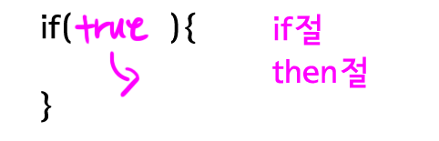
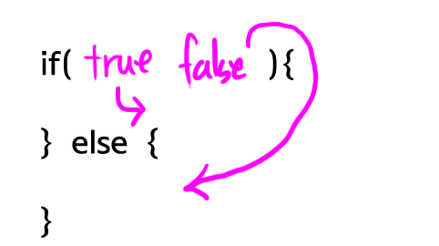
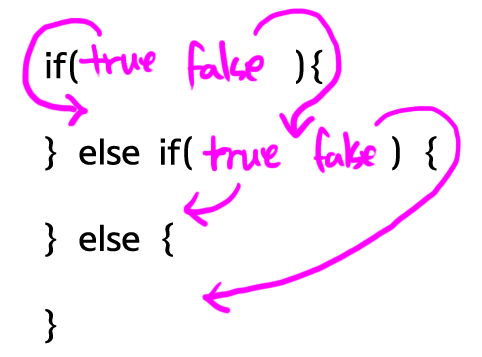

### 조건문

Boolean의 결과는 true/false이다. 이 Boolean 값을 기준으로 조건문 실행 흐름을 제어한다.

- #### 조건문

  - 주어진 조건에 따라서 애플리케이션을 다르게 동작하도록 하는 것
  - 프로그래밍의 핵심

- #### 조건문의 문법

  - if문
  - for문
  - while문

- #### if문

  - 조건문은 if로 시작

    

  - if절이 true이면 then절이 실행됨

    ```java
    if(true){ // if절
        System.out.println("result : true"); // then절
    }
    // 결과-result : true
    ```

    ```java
    if(false){
        System.out.println("result : true");
    }
    // 결과: 아무것도 출력이 안됨
    ```

    ```java
    if (true) {
        System.out.println(1);
        System.out.println(2);
        System.out.println(3);
        System.out.println(4);
    }
    System.out.println(5);
    //1
    //2
    //3
    //4
    //5
    ```

    ```java
    if(false){
        System.out.println(1);
        System.out.println(2);
        System.out.println(3);
        System.out.println(4);
    }
    System.out.println(5);
    //5
    ```

- #### else

  - if-else절은 if 절의 값이 true일 때 then절이 실행

  - false일 때 else절이 실행

    

    ```java
    if (true) {
        System.out.println(1);
    } else {
        System.out.println(2); // else절
    }
    //1
    ```

    ```java
    if(false){
        System.out.println(1);
    } else {
        System.out.println(2);
    }
    //2
    ```

- #### else if

  - if절의 값이 true라면 then절이 실행됨

  - false라면 else if절로 제어가 넘어감

  - else if절이 true라면 else if then절이 실행됨

  - false라면 else절이 실행됨

  - else절은 생략 가능

  - else절이 else if절보다 먼저 등장할 수는 없음

    

    ```java
    if (false) {
        System.out.println(1);
    } else if (true) {
        System.out.println(2);
    } else if (true) {
        System.out.println(3);
    } else {
        System.out.println(4);
    }
    //2
    ```

    ```java
    if(false){
        System.out.println(1);
    } else if(false) {
        System.out.println(2);
    } else if(true) {
        System.out.println(3);
    } else {
        System.out.println(4);
    }
    //3
    ```

    ```java
    if(false){
        System.out.println(1);
    } else if(false) {
        System.out.println(2);
    } else if(false) {
        System.out.println(3);
    } else {
        System.out.println(4);
    }
    //4
    ```

- #### 변수와 비교연산자 그리고 조건문

  - 사용자가 입력한 아이디 값을 체크하는 프로그램을 만들어 볼 것

  - ID의 값으로 egoing을 입력해보고, 다른 값도 입력해보자

  - 아래 코드를 컴파일 후, 실행해서 다양한 ID 값들을 입력해보기

    ```java
    String id = args[0];
    if(id.equals("egoing")) {
        System.out.println("right");
    } else {
        System.out.println("wrong");
    }
    ```

- #### 조건문의 중첩

  - 위 예제에서 아이디와 비밀번호 모두를 확인해야한다면?

    ```java
    String id = args[0];
    String password = args[1];
    if (id.equals("egoing")) {
        if (password.equals("111111")) {
            System.out.println("right");
        } else {
            System.out.println("wrong");
        }
    
    } else {
        System.out.println("wrong");
    }
    // 입력 egoing 111111
    // 둘 다 일치하면 right
    ```

    

- #### switch 문

  - 조건이 많을 때 사용

    ```java
    System.out.println("switch(1)");
    switch(1){
        case 1:
            System.out.println("one");
        case 2:
            System.out.println("two");
        case 3:
            System.out.println("three");
    }
    
    System.out.println("switch(2)");
    switch(2){
        case 1:
            System.out.println("one");
        case 2:
            System.out.println("two");
        case 3:
            System.out.println("three");
    }
    
    System.out.println("switch(3)");
    switch(3){
        case 1:
            System.out.println("one");
        case 2:
            System.out.println("two");
        case 3:
            System.out.println("three");
    }
    //switch(1)
    //one
    //two
    //three
    //switch(2)
    //two
    //three
    //switch(3)
    //three
    ```

    - 위 예제는 switch 뒤의 괄호에 숫자로 1이 주어지면 case 1에 해당하는 로직 이후 모든 case들이 실행됨

    ```java
    System.out.println("switch(1)");
    switch(1){
        case 1:
            System.out.println("one");
            break;
        case 2:
            System.out.println("two");
            break;
        case 3:
            System.out.println("three");
            break;
    }
    
    System.out.println("switch(2)");
    switch(2){
        case 1:
            System.out.println("one");
            break;
        case 2:
            System.out.println("two");
            break;
        case 3:
            System.out.println("three");
            break;
    }
    
    System.out.println("switch(3)");
    switch(3){
        case 1:
            System.out.println("one");
            break;
        case 2:
            System.out.println("two");
            break;
        case 3:
            System.out.println("three");
            break;
    }
    //switch(1)
    //one
    //switch(2)
    //two
    //switch(3)
    //three
    ```

    - 각 case 뒤에 break 조건을 추가해줌으로써, 조건문이 실행되고 중단함

  - case 대신 `default`를 추가하면, case에 없을 때 default구문을 실행함

    ```java
    System.out.println("switch(1)");
    switch(1){
        case 1:
            System.out.println("one");
            break;
        case 2:
            System.out.println("two");
            break;
        case 3:
            System.out.println("three");
            break;
        default:
            System.out.println("default");
            break;
    }
    
    System.out.println("switch(2)");
    switch(2){
        case 1:
            System.out.println("one");
            break;
        case 2:
            System.out.println("two");
            break;
        case 3:
            System.out.println("three");
            break;
        default:
            System.out.println("default");
            break;
    }
    
    System.out.println("switch(3)");
    switch(3){
        case 1:
            System.out.println("one");
            break;
        case 2:
            System.out.println("two");
            break;
        case 3:
            System.out.println("three");
            break;
        default:
            System.out.println("default");
            break;
    }
    
    System.out.println("switch(4)");
    switch(4){
        case 1:
            System.out.println("one");
            break;
        case 2:
            System.out.println("two");
            break;
        case 3:
            System.out.println("three");
            break;
        default:
            System.out.println("default");
            break;
    }
    //switch(1)
    //one
    //switch(2)
    //two
    //switch(3)
    //three
    //switch(4)
    //default
    ```

  - switch의 조건으로는 몇가지 제한된 데이터 타입만 사용가능

    - byte
    - short
    - char
    - int
    - enum
    - String
    - Character
    - Byte
    - Short
    - Integer